# Aperçu des rendus OpenSCAD

## Assemblage principal

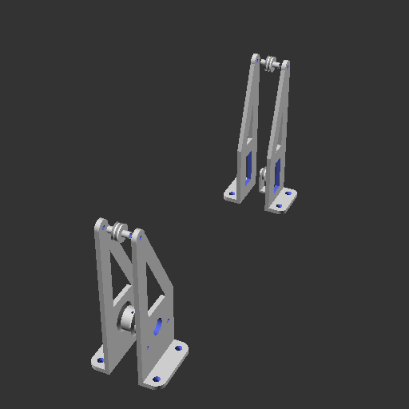

## Composants

### motorizedSupportComponent
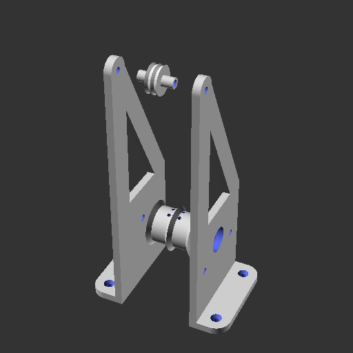

### mountingPulleyComponent
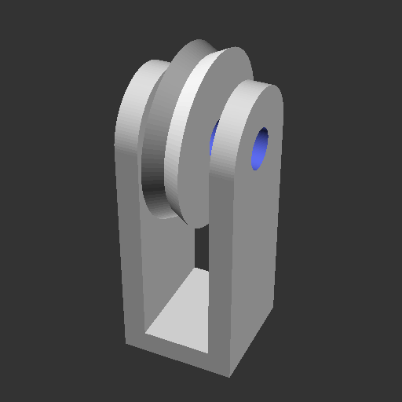

### simpleSupportComponent
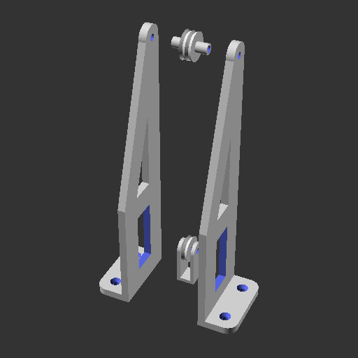

### topWheelsComponent
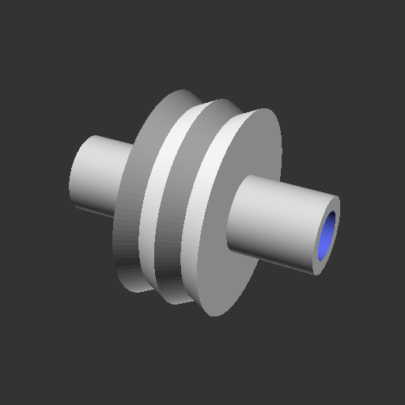

## Pièces

### caterpillarElementPiece
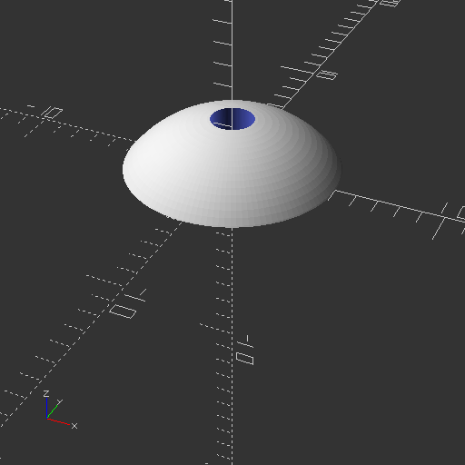

### motorReelWheelPiece
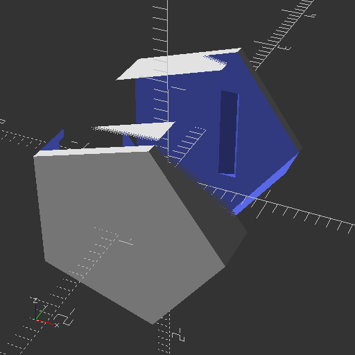

### pulleyPiece
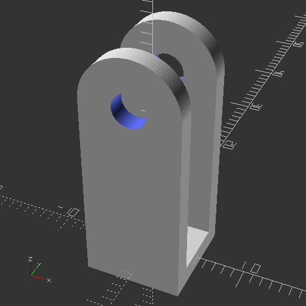

### pulleyWheelPiece
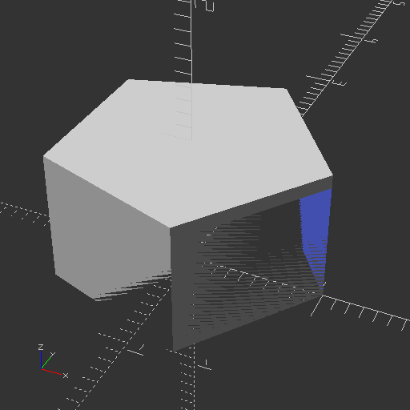

### simpleSupport1Piece
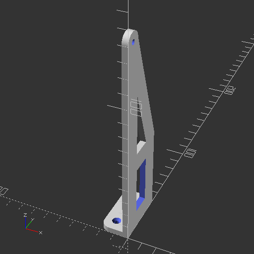

### simpleSupport2Piece
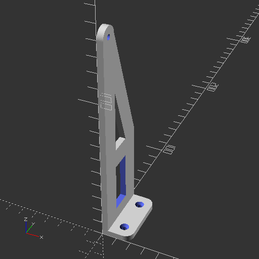

### supportBridgePiece
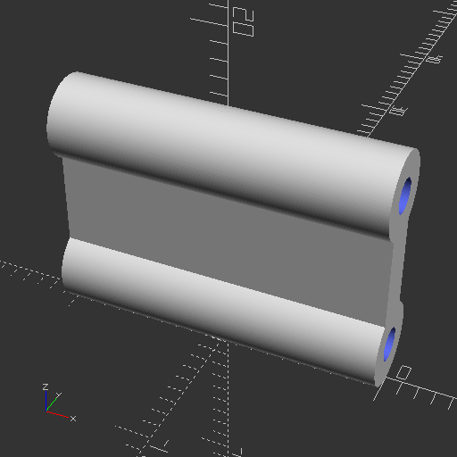

### supportMotor1Piece
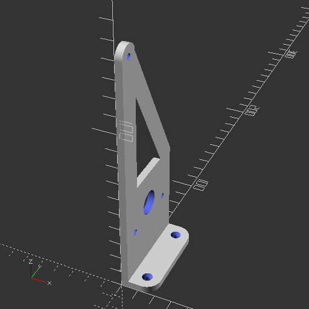

### supportMotor2Piece
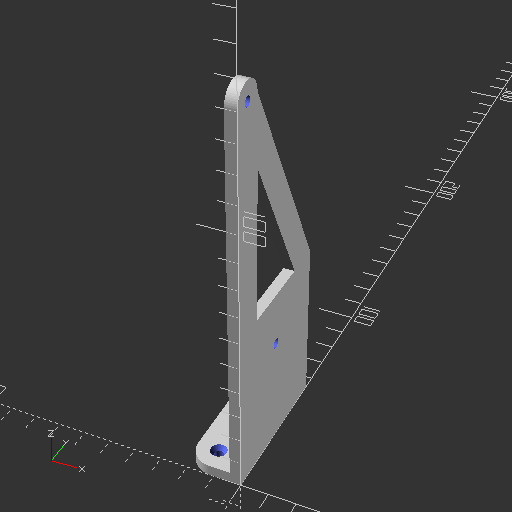

### supportWheelPiece

