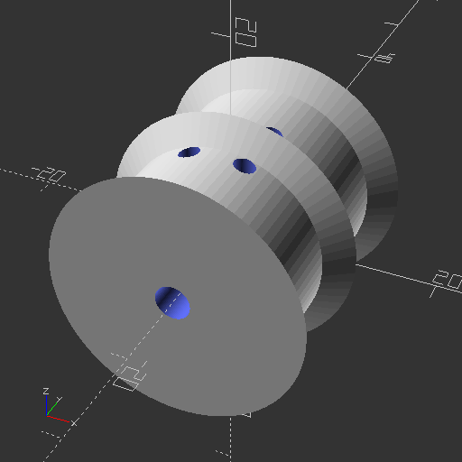
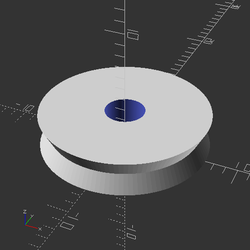
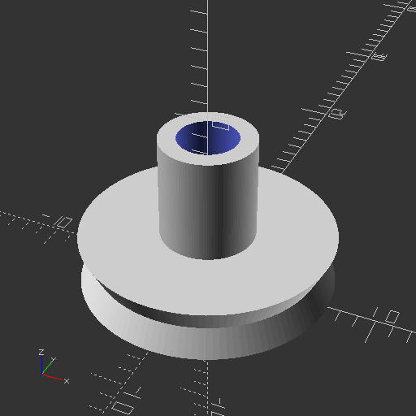

# Aperçu des rendus OpenSCAD

## Assemblage principal

## Composants

### motorizedSupportComponent

### mountingPulleyComponent

### simpleSupportComponent

### topWheelsComponent

## Pièces

### caterpillarElementPiece

### motorReelWheelPiece

### pulleyPiece

### pulleyWheelPiece

### simpleSupport1Piece

### simpleSupport2Piece

### supportBridgePiece

### supportMotor1Piece

### supportMotor2Piece

### supportWheelPiece

